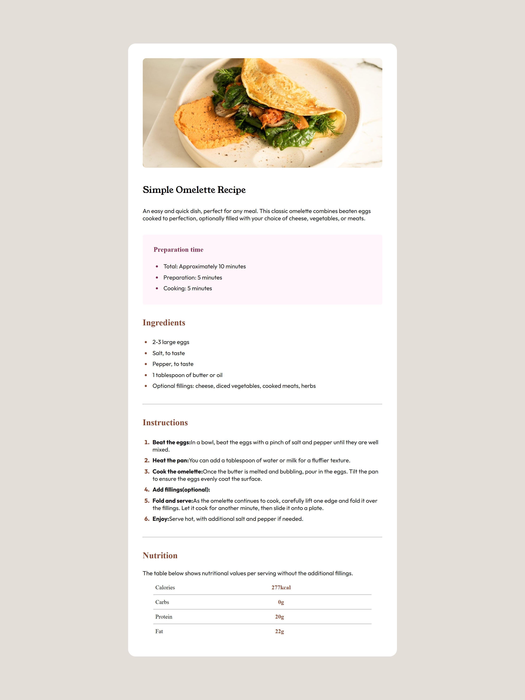
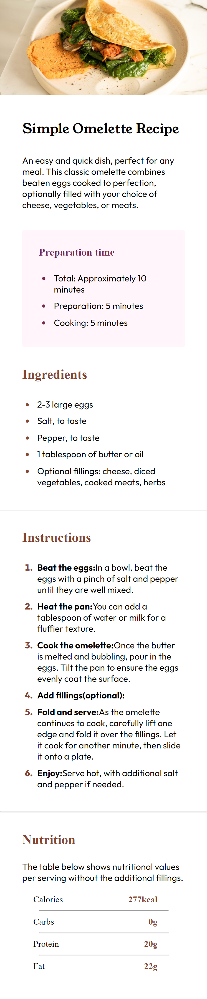

# Frontend Mentor - Recipe page solution

This is a solution to the [Recipe page challenge on Frontend Mentor](https://www.frontendmentor.io/challenges/recipe-page-KiTsR8QQKm). 

### Screenshot

### Links

- Live Site URL: 

## My process
I started  by creating a new HTML file called `index.html` in VS Code, then added basic structure for the recipe page including headings, paragraphs, an image, and a list. and i build each section writing html and css together.

### Built with

- Semantic HTML5 markup
- CSS custom properties
- Flexbox

### What I learned
Through this project i got handson with Basic HTML tags, flexbox, and basic margin,padding .
### Useful resources

- W3 school(https://www.w3schools.com/)

